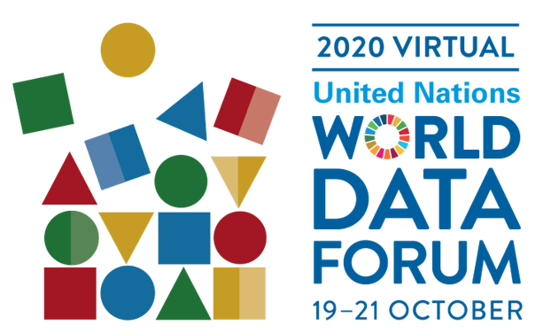

I was invited to participate in the [United Nations Data Forum 2020](https://unstats.un.org/unsd/undataforum/virtual-2020/).

### Data bridges for scientific & official data integration

My slides can be found on [Zenodo](http://doi.org/10.5281/zenodo.4273868). You will find the full set of slides presented at the full session, as well as a single-slide that was presented in the panel discussion session.

If you would like to cite the slides, please use:

*Gonzalez-Beltran, Alejandra. (2020, October). "Data bridges for scientific & official data integration". Zenodo. [http://doi.org/10.5281/zenodo.4273868](http://doi.org/10.5281/zenodo.4273868)*

See more details about the session at [the CODATA website](https://codata.org/multi-stakeholder-data-bridges-recording-of-our-live-discussion-relating-to-our-un-data-forum-session/) and the
[International Science Council](https://council.science/events/discussion-event-un-data-forum/).

### Session Description

Solving today’s global grand challenges demands that both scientific and policy research embrace new innovations and synergies as well as multi-stakeholder partnerships. In order to help build the bridges needed between different data ecosystem domains and communities, the International Science Council, acting as the global voice for science, and working with the UN, has determined the need to launch the CODATA Decadal Programme to build the international communities of practice needed to increase large-scale usability of data across the scientific and policy spheres.

Analyses can benefit from cross-cutting techniques not restricted to those of a single domain. International data used to monitor policy are a fundamental ingredient in many research projects, both in academia and for policy research. They facilitate and improve the quality of research on the ground and can also be improved through the incorporation of data from the scientific community and elsewhere. Creating a two-way bridge between scientific research data and official data is vital.

New technologies leverage huge amounts of data, relying on semantic integration, openness, and the use of machine-learning. They require a massively increased use of data from both traditional and new sources. The plethora of formats and semantics, and the paucity of metadata create barriers to employing the new data-intensive techniques. We do not need new standards, new classifications, and new technology approaches, so much as we need to make those we already have work together effectively through multi-stakeholder partnerships on a broad scale.

Initial work has started through a series of workshops, projects and case studies, bringing together experts from diverse communities. The effort is use-case driven, covering urban resilience, disaster risk reduction, and infectious disease. These efforts are producing early draft guidelines – grounded in the FAIR data principles – to help build the communities of practice for the use of data across domain boundaries. The FAIR data principles are gaining traction across the global data ecosystem and being embraced by multiple stakeholders, including international organizations, public sector, civil society, academia and the business community.

Building on existing technical standards such as DDI and SDMX, on the wealth of semantic technologies from the W3C and elsewhere, and on machine-learning and data science techniques, the Decadal Programme will bring a cross-disciplinary, trans-community approach to how we manage, combine and use data. This session will provide an overview of these efforts, covering data documentation, technology, semantic integration, dissemination, and other key aspects.

### Session Recording

<iframe loading="lazy" src="https://player.vimeo.com/video/469702557" width="640" height="360" frameborder="0" allowfullscreen="allowfullscreen"></iframe>